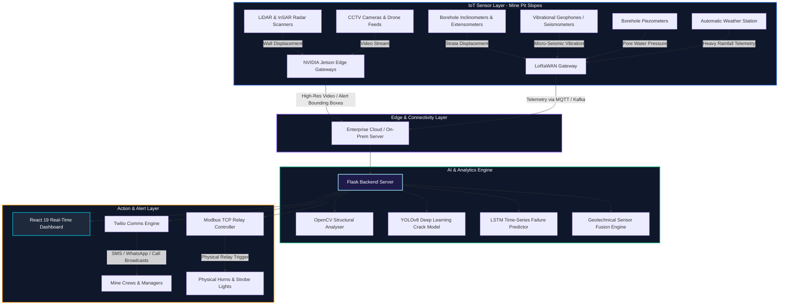

# 🏔️ AI-Based Rockfall Prediction & Alert System
## Startup Product Blueprint & Commercialization Roadmap

This blueprint acts as a comprehensive technical guide and business deck for the **AI-Based Rockfall Prediction & Alert System** (Product name: **RockGuard AI**). It documents what features are currently running in the codebase, and outlines the exact requirements and architecture needed to scale this prototype into a 100% production-ready enterprise safety system that can be pitched to open-pit mining companies globally.

---

## 🗺️ System Architecture Overview

To achieve 100% operational safety in real-world open-pit mines, the system requires a multi-layered sensor-fusion and computing architecture:

---

## 🔎 Part 1: Current Project Audit (What Runs Right Now)

The current system is built as a fully functional full-stack prototype with a React frontend and Python Flask backend. The sidebar routing has been mapped directly to all the safety modules, enabling a clean, interactive user experience:

### 1. Flask AI Prediction Backend (`backend/app.py`)
The backend is a Python-based server that processes image streams and provides geological hazard estimations:
* **Crack Detection Algorithm**: Converts images to grayscale, applies **Canny Edge Detection**, computes contours, and filters them based on aspect ratio (since rock cracks are long and thin) to output high-severity hazard zones.
* **Loose Rock Detection Algorithm**: Uses **Gaussian Blur** and **Otsu’s Adaptive Thresholding** to isolate disjointed rocks from solid rock faces, tracking size thresholds for risk categorization.
* **Structural Damage Analyser**: Dilates edge segments using morphological kernels to group structural weaknesses.
* **Gas Leak Simulation**: Stochastic critical-event simulator designed for visual risk representation.
* **API Endpoints**:
  * `POST /api/process_frame`: Decodes base64 frames from webcams or uploads, runs computer vision detection, draws annotated boxes, and returns data payloads with confidence indices.
  * `POST /api/emergency_stop`: Deactivates sensor triggers immediately.
  * `POST /api/start_detection` & `POST /api/stop_detection`: Runs stateful tracking.

### 2. React 19 Frontend Dashboard (`frontend/src/`)
The user interface is structured around a dark-themed geological intelligence dashboard:
* **Interactive Geological Map (`components/RiskMap.jsx`)**: Displays coordinate-based map zones for major mining states in India (Jharkhand, Odisha, Rajasthan, Karnataka, etc.) with custom hover states, risk levels, and hazard probability sizes.
* **AI Computer Vision Dashboard (`components/ImageUploadAnalysis.jsx`)**: Lets users upload photographs of rock faces or connect live camera feeds, which automatically send frames to the Flask server and render bounding boxes in real-time.
* **Predictive Safety Modeler (`components/PredictionModel.jsx`)**: Renders chart visualizations (Factor of Safety trends, displacement increments, seismic vibration amplitudes, pore water pressure curves) to demonstrate predictive data logging.
* **Alert System & TARP (`components/AlertSystem.jsx`)**: An interactive dashboard showing active, acknowledged, and resolved alerts, alongside automated step-by-step Trigger Action Response Plans (e.g., immediate evacuation, road barriers deployment).
* **Communications Center (`components/SMSWhatsAppAlerts.jsx`)**: Enables configuring emergency phone lists, contact details for safety supervisors, and toggles for automated alert channels.
* **Environmental Monitor (`components/EnvironmentalMonitor.jsx`)**: Tracks active rainfall metrics (a main landslide trigger) and lists sensor network hardware health statistics.
* **Audit & Reports Generator (`components/ReportGenerator.jsx`)**: Offers summary generation and layout controls for compliance and safety audits.

---

## 🛠️ Part 2: Commercial Core Requirements (To Make it 100% Live)

To convert this prototype into a commercial-grade product to sell to mine owners, you must implement the following production modules:

### 1. Physical Hardware & Geotechnical Sensors Integration
In open-pit mines, digital visual AI alone is not enough; rockfalls are preceded by tiny structural movements. A commercial system must integrate actual telemetry from these sensors:

| Sensor Type | Industrial Parameter Captured | How It Connects to RockGuard AI |
| :--- | :--- | :--- |
| **InSAR (Interferometric Radar)** | Millimeter-level pit wall swelling and sliding displacement. | REST API integration with Leica/IDS GeoRadar software. |
| **Borehole Inclinometers** | Underground rock strata slippage along shear planes. | RS485 Modbus RTU telemetry to a LoRaWAN transmitter. |
| **Vibration Geophones** | High-frequency micro-seismic acoustic crack sounds in the rock. | Analog-to-Digital (ADC) converter, streaming vibration waveforms. |
| **Piezometers (Pore Pressure)** | Underground water pressure buildup (highly correlated to slope failure). | Vibrating wire sensor connected to a cellular/LoRa gateway. |
| **Industrial CCTV (PTZ)** | HD zoom visual feed of faults and slide blocks. | RTSP (Real-Time Streaming Protocol) H.264 video streams. |
| **AWS (Weather Station)** | Real-time rainfall rate (e.g., > 10mm/hr activates high-risk alerts). | MQTT message payload sent every 5 minutes. |

### 2. Upgrading the AI/ML Layer (From OpenCV to Deep Learning)
Replace the simple OpenCV edge-detection filters in `app.py` with state-of-the-art ML models:

* **Object Detection & Segmentation (Visual AI)**:
  * Deploy a custom **YOLOv8-Segmentation** or **YOLOv11** model trained specifically on mining rock crack datasets (like the *Geological Crack Dataset*).
  * This allows the AI to accurately differentiate between shadows, vegetation on the rock face, and real rock cracks.
* **Predictive Time-of-Failure (LSTM)**:
  * Deploy a **Long Short-Term Memory (LSTM)** neural network on the slope displacement data.
  * Implement the **Inverse Velocity Method** (Saito's Method) to compute the exact hour of expected wall collapse. If the displacement rate accelerates exponentially, trigger immediate red alerts.
* **Geotechnical Sensor Fusion**:
  * Build an **XGBoost Classifier** that accepts input parameters: `[Displacement Rate, Pore Pressure, Seismic Event Count, Hourly Rainfall]`.
  * The model outputs a unified **Geological Stability Index (GSI)**, which is vastly more accurate than individual sensor threshold triggers.

### 3. Edge-Computing Infrastructure
High-resolution camera feeds cannot be streamed over poor mine cellular links to the cloud.
* **Local Edge Nodes**: Deploy **NVIDIA Jetson Orin** edge boxes at CCTV junction towers.
* **Local Processing**: Jetson runs the YOLOv8 model locally and sends only alert telemetry, frames, and small video clips to the cloud server when anomalies are detected.
* **Industrial Networking**: Use **LoRaWAN** gateways mounted on the mine surface to collect low-frequency sensor telemetry (vibration, inclinometers) across 5-10 kilometers without needing fiber cables.

### 4. Direct Industrial Alert Integrations
A commercial alert system cannot just display warnings on a web dashboard; it must actively prevent fatalities:
* **Audio-Visual Strobe Sirens**: Deploy network-enabled industrial sirens. The Flask backend uses **Modbus TCP** command packages to flip a hardware relay, immediately sounding horns and strobe lights in the mine pits.
* **Automated Voice Calls & Mass SMS**: Integrate **Twilio Programmable Voice** to dial the mine manager's phone automatically if a "Critical" slope failure risk is reached, reading out a warning text-to-speech script.
* **WhatsApp Alerts**: Use WhatsApp Business API for instant risk map snapshots sent directly to mine supervisors' mobile phones.

### 5. Regulatory Compliance & GIS Mapping
* **Real GIS Layer**: Replace the SVG maps with **Mapbox GL JS** or **Leaflet.js**, overlaying actual mine coordinates, satellite images, and 3D digital elevation models (DEM) of the pit.
* **DGMS / MSHA Standard PDF Exporters**: Build template compliance reports using libraries like `pdfmake` or backend report generators. Ensure the PDF outputs meet local legal requirements (e.g., Directorate General of Mines Safety (DGMS) in India or Mine Safety and Health Administration (MSHA) in the USA), containing date stamps, sensor calibration status, and safety officer digital signatures.

---

## 📈 Part 3: Business Pitch & Value Proposition for Mining Companies

When presenting **RockGuard AI** to investors, mine managers, or safety directors, emphasize these financial and operational advantages:

1. **Zero-Accident Safety Compliance**: Helps mining companies comply with rigorous governmental safety acts, avoiding heavy fines, operational shutdowns, and legal liabilities.
2. **Predictive Maintenance vs. Reactive Damage**: Instead of shutting down a mine *after* a landslide occurs (costing millions of dollars in cleared haul roads and damaged excavators), the system gives **24 to 72 hours of advanced warning** so equipment can be safely relocated.
3. **Insurance Premium Reduction**: Demonstrating an automated sensor-fusion safety system allows mining conglomerates to negotiate significantly lower insurance rates for their mine assets.
4. **Autonomous Monitoring**: Reduces the necessity of manual geological inspections on dangerous benches, keeping surveyors safe.

---

## 🚀 Quick Step-by-Step Production Plan

1. **Phase 1: Database Migration**: Set up PostgreSQL or MongoDB to replace mock datasets, storing real-time historical logs.
2. **Phase 2: Camera PTZ Streams**: Integrate an RTSP decoder (e.g., Python `decord` or `FFmpeg`) in `backend/app.py` to stream live feed frames from local IP cameras.
3. **Phase 3: Deploy YOLOv8 Model**: Train and export a YOLOv8 weight file (.pt / .onnx) and replace the basic Canny filters in the detection class.
4. **Phase 4: Setup SMS Gateway**: Put your Twilio API keys into a backend `.env` file to activate physical SMS and automated phone calling logs.
5. **Phase 5: Field Testing**: Deploy one CCTV camera and one displacement sensor at a test quarry slope, calibrate values, and verify the alert notifications.
