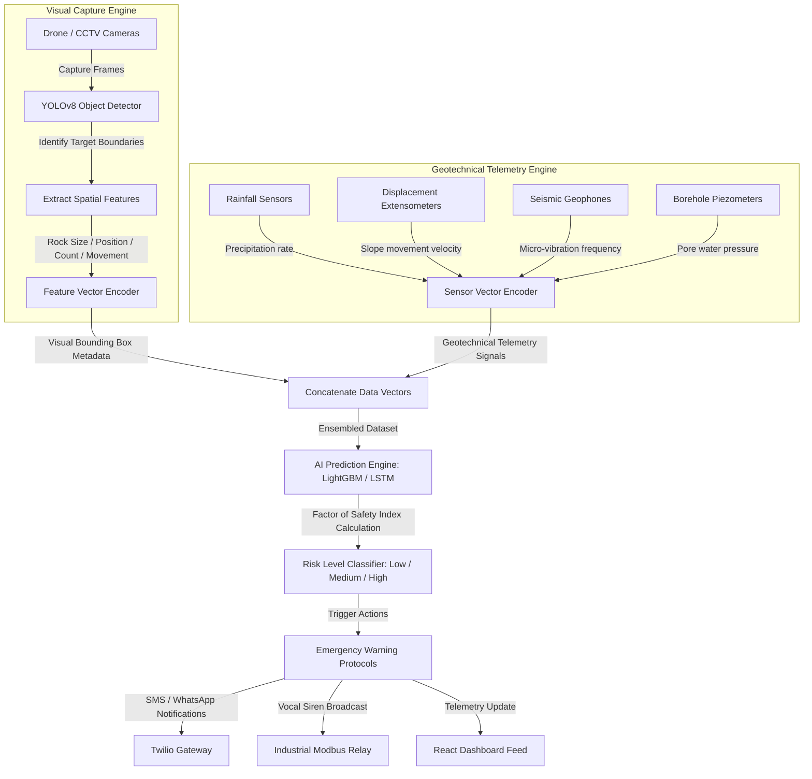

# 🧠 Geotechnical Prediction Engine & Mathematical Architecture
## RockGuard AI Predictive Modeling Specification

This document provides a detailed description of the mathematical algorithms, neural network configurations, and data processing models utilized by **RockGuard AI** to predict geotechnical failures and calculate the exact **Time-of-Failure (ToF)** in open-pit mines.

---

## 🗺️ Multi-Modal Prediction Pipeline Flowchart

Here is the computational and data pipeline flow of the RockGuard AI prediction model:



---

## 📋 Detailed Project Workflow

### Step 1: Image Collection
Drones or CCTV cameras continuously capture high-resolution images or video feeds of the mine slope or quarry walls.

### Step 2: Object Detection via YOLOv8
The YOLOv8 deep learning model analyzes every video frame in real time. It is trained to detect specific geotechnical hazards, drawing a bounding box around:
* **Rocks & Loose Boulders** that show signs of detachment.
* **Cracks & Fractures** propagating on the slope wall.
* **Falling Rocks** indicating an active landslide event.

### Step 3: Visual Feature Extraction
From the detected object bounding boxes, the system extracts numerical metadata:
* **Rock Size**: Extracted via bounding box area.
* **Rock Location**: Bounding box center coordinates $(x, y)$.
* **Confidence Score**: Probability metric output by the YOLOv8 classification head.
* **Number of Rocks**: Counts the total active boulders in the frame.
* **Rock Movement**: Calculated by tracking the displacement vector $(\Delta x, \Delta y)$ of rock coordinates between consecutive frames.

### Step 4: Combine with Geotechnical Sensor Data
The spatial visual features extracted by YOLOv8 are combined into a unified dataset alongside raw telemetry from slope monitoring hardware:
* **Rainfall Rate** ($R_t$) from automatic weather stations.
* **Ground Vibration** ($a_t$) from geophones.
* **Slope Bending Angle** from inclinometers.
* **Displacement Sensor readings** ($d_t$) from wire extensometers.
* **Pore Water Pressure** ($p_t$) from borehole piezometers.

### Step 5: AI Prediction (LightGBM & LSTM)
The prediction model (LightGBM for tabular fusion, and LSTM for sequential creep mapping) processes the combined datasets to estimate the rockfall probability:

| Input Variable | Telemetry Value | AI Evaluation |
| :--- | :--- | :--- |
| **Active Crack Detected** | Yes | Visual Feature Flag |
| **Rock Movement Velocity** | $15 \text{ cm/hr}$ | Structural Displacement Alert |
| **Precipitation (Rainfall)** | High | Environmental Catalyst |
| **Seismic Ground Vibration** | Medium | Micro-seismic Fracture Amplitudes |

**Prediction Result**: $92\%$ probability of imminent collapse $\rightarrow$ **High Risk / Critical Alert Triggered.**

### Step 6: Emergency Alert Generation
If the predicted safety factor falls below thresholds or the probability model breaches limits:
1. An **SMS & WhatsApp broadcast** is pushed to active mine crews.
2. An **Email alert** containing risk metadata and maps is sent to safety supervisors.
3. The **React Dashboard** displays visual red alerts on the Geological map and safety status indicator.
4. Local **horns and sirens** are triggered to evacuate the danger zone immediately.

---

## 📈 1. Geotechnical Telemetry & Variables

The predictive engine processes four primary continuous-time signals:

| Variable Symbol | Geotechnical Property | Measurement Sensor | Sampling Rate ($f_s$) |
| :--- | :--- | :--- | :--- |
| $d_t$ | Cumulative Surface Displacement (mm) | Extensometers / Inclinometers | $1 \text{ Hz}$ |
| $p_t$ | Borehole Pore Water Pressure (kPa) | Vibrating-Wire Piezometer | $0.2 \text{ Hz}$ |
| $a_t$ | Acoustic Emission Amplitude (mV) | Vibrational Geophones | $1000 \text{ Hz}$ |
| $R_t$ | Rainfall Precipitation Rate (mm/hr) | Digital Weather Station | $0.003 \text{ Hz}$ (5 min) |

---

## 🤖 2. Time-Series Forecasting: LSTM Recurrent Neural Networks

Cumulative displacement ($d_t$) and acoustic emission rates ($a_t$) are sequence-dependent. The system processes these signals using a **Long Short-Term Memory (LSTM)** network, which avoids the vanishing gradient problem of standard Recurrent Neural Networks (RNNs) by maintaining an active cell state ($C_t$).

```text
               Cell State (C_t-1) --------> [x] -----------------------------> C_t
                                             |                                  ^
                                             v (Forget Gate f_t)                | (+)
                                             |                                  |
    Hidden State (h_t-1) ---> [Concat] ----> |   [Input Gate i_t] --> [*] ------|
                                |            |                         ^
    Input Tensor (X_t) --------+            +-------> [tanh] ---------+
```

### LSTM Mathematical Equations
For each time step $t$, the LSTM cell performs the following matrix transformations:

1. **Forget Gate ($f_t$)**: Decides what percentage of the historical cell state to discard.
   
$$f_t = \sigma(W_f \cdot [h_{t-1}, X_t] + b_f)$$

2. **Input Gate ($i_t$) & Candidate Cell State ($\tilde{C}_t$)**: Determines which new information to store in the cell state.
   
$$i_t = \sigma(W_i \cdot [h_{t-1}, X_t] + b_i)$$

$$\tilde{C}_t = \tanh(W_c \cdot [h_{t-1}, X_t] + b_c)$$

3. **Cell State Update ($C_t$)**: Combines historical cell state and new candidate inputs.
   
$$C_t = f_t \odot C_{t-1} + i_t \odot \tilde{C}_t$$

4. **Output Gate ($o_t$) & Hidden State ($h_t$)**: Outputs the filtered hidden state prediction vector.
   
$$o_t = \sigma(W_o \cdot [h_{t-1}, X_t] + b_o)$$

$$h_t = o_t \odot \tanh(C_t)$$

*Where:*
* $\sigma(x) = \frac{1}{1 + e^{-x}}$ is the sigmoid activation function.
* $\odot$ represents the Hadamard (element-wise) product.
* $X_t = [d_{t-k}, \dots, d_t]$ is the input sliding window tensor of historical displacement metrics.
* $h_t$ is the predicted forward vector containing predicted future displacements $[d_{t+1}, \dots, d_{t+n}]$.

---

## ⏱️ 3. Saito's Inverse Velocity Method (Time-of-Failure Prediction)

Once future displacement rates are predicted by the LSTM, the system applies **Saito's Creep Analysis** to identify the collapse horizon. 

During the tertiary creep stage of slope deformation, the displacement velocity ($v$) accelerates exponentially. Saito proved that the inverse of this velocity ($1/v$) behaves linearly over time, descending toward zero as collapse approaches.

```text
Slope Displacement Stages
   Displacement (d)
     ^                                         / (Tertiary Creep: Sudden Acceleration)
     |                                       /
     |                       --------------- (Secondary Creep: Constant Velocity)
     |                     /
     |       ------------- (Primary Creep: Settling)
     |     /
     +----------------------------------------> Time (t)
```

### Saito Linearization & Projection Equations
1. The displacement velocity at time step $t$ is computed as the derivative of displacement:
   
$$v_t = \frac{\Delta d}{\Delta t} = \frac{d_t - d_{t-1}}{t - (t-1)}$$

2. The system calculates the inverse velocity:
   
$$Y_t = \frac{1}{v_t}$$

3. Applying **Linear Least Squares Regression** on the sliding prediction window of $Y$, we calculate the slope ($m$) and intercept ($c$):
   
$$Y(t) = m \cdot t + c$$

$$m = \frac{N \sum(t \cdot Y_t) - \sum t \sum Y_t}{N \sum(t^2) - (\sum t)^2}$$

4. The **Time-of-Failure ($t_F$)** occurs when the velocity reaches infinity, meaning the inverse velocity reaches zero ($Y(t_F) = 0$):
   
$$0 = m \cdot t_F + c \implies t_F = -\frac{c}{m}$$

5. The remaining warning time window ($\Delta t_{\text{warn}}$) before failure occurs is:
   
$$\Delta t_{\text{warn}} = t_F - t_{\text{current}}$$

*If $\Delta t_{\text{warn}} < 2.0 \text{ hours}$, the backend bypasses confirmation loops and triggers evacuation alarms immediately.*

---

## 🧬 4. Multi-Sensor Data Fusion Engine

Single-sensor triggers cause false alerts. RockGuard AI uses a **Random Forest Regressor** to evaluate the combined indicators, outputting a unified **Factor of Safety (FoS)** coefficient.

### Feature Mapping Matrix
Input telemetry values are mapped into a standardized vector $F$:

$$F = [v_{\text{disp}}, \Delta v_{\text{disp}}, p_{\text{pore}}, a_{\text{acoustic}}, R_{\text{rain}}]$$

*Where:*
* $v_{\text{disp}}$ is the velocity of slope movement.
* $\Delta v_{\text{disp}}$ is the acceleration of slope movement.
* $p_{\text{pore}}$ is the pore water pressure.
* $a_{\text{acoustic}}$ is the micro-seismic acoustic emission count.
* $R_{\text{rain}}$ is the precipitation rate.

### Random Forest Ensemble Regression
The Forest aggregates predictions from $B$ independent decision trees:

$$\text{FoS} = \frac{1}{B} \sum_{b=1}^{B} T_b(F)$$

The safety coefficient (FoS) maps directly to warning alerts:

```text
+-------------------+---------------------------------------------------+
| FoS Value Range   | Safety Level Classification                       |
+-------------------+---------------------------------------------------+
| FoS > 1.25        | Stable Slope (Normal Operations)                  |
| 1.00 < FoS <= 1.25| Marginally Stable (Yellow Warning Alert Issued)    |
| FoS <= 1.00       | Active Failure (Evacuation Alarms Activated)      |
+-------------------+---------------------------------------------------+
```

---

## 📡 5. Pre-Processing Pipeline: Kalman Filtering

Raw seismic signals ($a_t$) and displacement readings ($d_t$) are subject to environmental sensor noise (such as mining truck vibrations and blasting waves). To filter out noise without losing actual trends, the system runs a **Kalman Filter**:

### 1. Prediction Equations:
Predict the state estimate ($\hat{x}_{t|t-1}$) and error covariance ($P_{t|t-1}$):

$$\hat{x}_{t|t-1} = A \hat{x}_{t-1|t-1}$$

$$P_{t|t-1} = A P_{t-1|t-1} A^T + Q$$

### 2. Correction Equations:
Compute the Kalman Gain ($K_t$) and update the state estimate ($\hat{x}_{t|t}$) and error covariance ($P_{t|t}$):

$$K_t = P_{t|t-1} H^T (H P_{t|t-1} H^T + R)^{-1}$$

$$\hat{x}_{t|t} = \hat{x}_{t|t-1} + K_t (z_t - H \hat{x}_{t|t-1})$$

$$P_{t|t} = (I - K_t H) P_{t|t-1}$$

*Where:*
* $z_t$ is the noisy raw sensor measurement.
* $\hat{x}_{t|t}$ is the filtered sensor value passed to the LSTM engine.
* $Q$ and $R$ represent process noise covariance and measurement noise covariance respectively.
