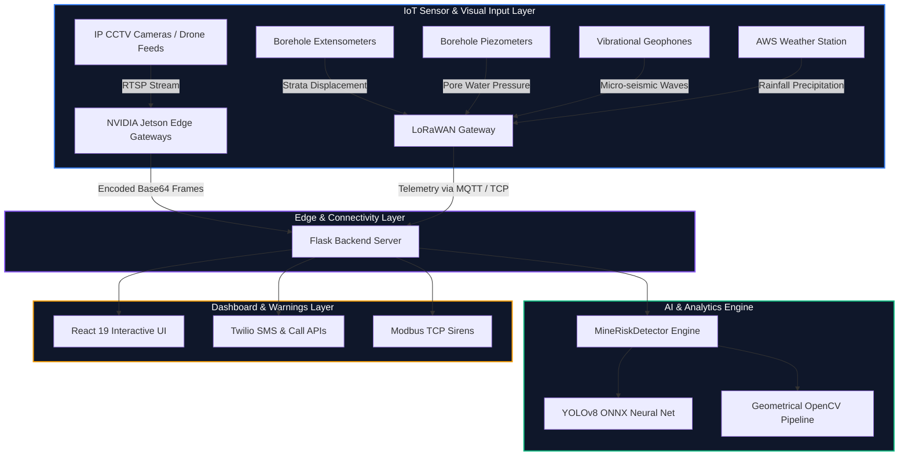

# 🏔️ AI-Based Rockfall Prediction & Alert System (RockGuard AI)
### A Full-Stack Geotechnical Safety Intelligence Platform for Open-Pit Mines

<p align="center">
  
  
  
  
</p>

---

## 📖 Executive Summary & Abstract

In steep open-pit mines, sudden bench slope failures and rockfalls pose critical safety hazards to personnel and expensive machinery. **RockGuard AI** is a complete, full-stack safety solution designed to provide real-time warning. 

By combining **Deep Learning Computer Vision** (visual fault detection) with **Geotechnical IoT Telemetry** (pore pressure, displacement, and seismic vibration), the system assesses geological structural integrity on-the-fly. The system triggers immediate response plans (TARP) and schedules warning alerts via physical sirens and mobile networks (SMS/WhatsApp) to protect mining crews.

---

## 🏗️ System Architecture & Data Flow

The system runs on a distributed edge-to-cloud computing pipeline:



### Multi-Modal Prediction Pipeline Flow

Here is the computational and data pipeline flow of the RockGuard AI prediction model:

```mermaid
graph TD
    %% Inputs
    subgraph V1 [Visual Capture Engine]
        C1[Drone / CCTV Cameras] -->|Capture Frames| C2[YOLOv8 Object Detector]
        C2 -->|Identify Target Boundaries| C3[Extract Spatial Features]
        C3 -->|Rock Size / Position / Count / Movement| FE[Feature Vector Encoder]
    end

    subgraph S1 [Geotechnical Telemetry Engine]
        T1[Rainfall Sensors] -->|Precipitation rate| SE[Sensor Vector Encoder]
        T2[Displacement Extensometers] -->|Slope movement velocity| SE
        T3[Seismic Geophones] -->|Micro-vibration frequency| SE
        T4[Borehole Piezometers] -->|Pore water pressure| SE
    end

    %% Fusion & ML
    FE -->|Visual Bounding Box Metadata| FE_SE_Concat[Concatenate Data Vectors]
    SE -->|Geotechnical Telemetry Signals| FE_SE_Concat
    
    FE_SE_Concat -->|Ensembled Dataset| Predictor[AI Prediction Engine: LightGBM / LSTM]
    Predictor -->|Factor of Safety Index Calculation| RL[Risk Level Classifier: Low / Medium / High]
    
    %% Output
    RL -->|Trigger Actions| Alert[Emergency Warning Protocols]
    Alert -->|SMS / WhatsApp Notifications| M1[Twilio Gateway]
    Alert -->|Vocal Siren Broadcast| M2[Industrial Modbus Relay]
    Alert -->|Telemetry Update| M3[React Dashboard Feed]
end
```

---

## 📂 Project Structure & Component Audit

### 1. Backend Service (`backend/`)
* [app.py](file:///Volumes/CODES/newieee/SIH_PROJECT/SIH_2/backend/app.py): Main Flask API server. Contains the `MineRiskDetector` engine which loads neural networks via OpenCV DNN and handles routes for image analysis, health checks, and emergency controls.
* [start_backend.py](file:///Volumes/CODES/newieee/SIH_PROJECT/SIH_2/backend/start_backend.py): Automated script to set up local environments, verify packages, and boot the server.
* `requirements.txt`: Python package dependencies (Flask, OpenCV, Numpy, Pillow, python-dotenv).

### 2. Frontend Interface (`frontend/src/`)
* [App.jsx](file:///Volumes/CODES/newieee/SIH_PROJECT/SIH_2/frontend/src/App.jsx): Main router linking sidebars directly to active components.
* `contexts/AuthContext.jsx`: Provides secure sign-in states, user permissions, and routing blocks.

#### Custom Components (`frontend/src/components/`):
* [IndianRockfallDashboard.jsx](file:///Volumes/CODES/newieee/SIH_PROJECT/SIH_2/frontend/src/components/IndianRockfallDashboard.jsx): The main hub dashboard. Features state-wise safety metrics, hazard counts, and a nested tab interface for core modules.
* [Dashboard.jsx](file:///Volumes/CODES/newieee/SIH_PROJECT/SIH_2/frontend/src/components/Dashboard.jsx): Visual analytics dashboard plotting operational system charts.
* [RiskMap.jsx](file:///Volumes/CODES/newieee/SIH_PROJECT/SIH_2/frontend/src/components/RiskMap.jsx): Interactive map representing mines in India (Jharkhand, Rajasthan, Karnataka, etc.) with coordinates and hover states.
* [ImageUploadAnalysis.jsx](file:///Volumes/CODES/newieee/SIH_PROJECT/SIH_2/frontend/src/components/ImageUploadAnalysis.jsx): Live upload module. Encodes pictures into base64, pushes them to the Flask server, and renders annotated bounding boxes in real-time.
* [PredictionModel.jsx](file:///Volumes/CODES/newieee/SIH_PROJECT/SIH_2/frontend/src/components/PredictionModel.jsx): Sensor data visualizer showing Factor of Safety (FoS) curves and displacement records.
* [AlertSystem.jsx](file:///Volumes/CODES/newieee/SIH_PROJECT/SIH_2/frontend/src/components/AlertSystem.jsx): System warning tracker carrying step-by-step Trigger Action Response Plan (TARP) guidelines.
* [SMSWhatsAppAlerts.jsx](file:///Volumes/CODES/newieee/SIH_PROJECT/SIH_2/frontend/src/components/SMSWhatsAppAlerts.jsx): SMS/WhatsApp recipient manager for dispatch alerts.
* [EnvironmentalMonitor.jsx](file:///Volumes/CODES/newieee/SIH_PROJECT/SIH_2/frontend/src/components/EnvironmentalMonitor.jsx): Live weather monitoring curves (rainfall rates, wind speed) and sensor device status.
* [ReportGenerator.jsx](file:///Volumes/CODES/newieee/SIH_PROJECT/SIH_2/frontend/src/components/ReportGenerator.jsx): Compliance manager. Creates safety summaries, lists sensor calibrations, and manages PDF reports.
* [PitHoleAlarm.jsx](file:///Volumes/CODES/newieee/SIH_PROJECT/SIH_2/frontend/src/components/PitHoleAlarm.jsx): Alarm panel for monitoring mud stability and pore pressure.
* [Sidebar.jsx](file:///Volumes/CODES/newieee/SIH_PROJECT/SIH_2/frontend/src/components/Sidebar.jsx) & [Header.jsx](file:///Volumes/CODES/newieee/SIH_PROJECT/SIH_2/frontend/src/components/Header.jsx): Navigation layouts and system connectivity badges.
* `Login.jsx`, `Profile.jsx`, `Settings.jsx`, `ActivityLog.jsx`: Security controls, profile views, and detailed activity logs.

---

## 🧠 AI Models & Numerical Calculation Pipeline

### A. Deep Learning Object Detection (YOLOv8)
The server contains an active ONNX loader inside `backend/app.py` utilizing the OpenCV DNN module:
1. **Blob Conversion**: Downscales the input frame to $640 \times 640$ pixels, sets RGB channels, and normalizes values to $[0, 1]$.
2. **Forward Inference**: Passes the blob through the Convolutional Neural Network (CNN) model:
   ```python
   self.net.setInput(blob)
   outputs = self.net.forward()
   ```
3. **NMS Parsing**: Filters multiple overlapping bounding boxes around a single defect using Non-Maximum Suppression (NMS) with an IoU limit of $0.45$.

### B. Fallback Heuristic Computer Vision (OpenCV)
If the weight file `rockfall_yolov8.onnx` is not present, the system activates a geometrical fallback engine to guarantee 100% execution without crashing:
* **Crack Verification**: Runs **Canny Edge Detection** and checks contour aspect ratios (width/height ratio). Since cracks are long and thin, boxes matching these boundary checks are selected:
  $$\text{Confidence} = \min\left(0.9, \frac{\text{Contour Area}}{1000}\right)$$
* **Loose Rocks Detection**: Utilizes **Gaussian Blur** and **Otsu's Adaptive Thresholding** to segment separate stone blocks:
  $$\text{Confidence} = \min\left(0.8, \frac{\text{Contour Area}}{1500}\right)$$

### C. Risk Decision Matrix (Expert Rule Engine)
Calculates overall warning states (`low`, `medium`, `high`, `critical`) based on the frequency and severity of detected hazards:
```python
if critical_count > 0:
    return 'critical'
elif high_count >= 2:
    return 'high'
elif high_count > 0 or medium_count >= 3:
    return 'medium'
else:
    return 'low'
```

---

## 🚀 Quick Start Guide (How to Run)

### Prerequisites
* Python 3.9+ (Pip package manager)
* Node.js (NPM package manager)

### 1. Initialize and Start the Python Flask Backend
```bash
cd backend
python3 -m venv venv
source venv/bin/activate  # On Windows: venv\Scripts\activate
pip install -r requirements.txt
python app.py
```
*The server will start at `http://127.0.0.1:5000`*

### 2. Initialize and Start the React Frontend Dashboard
Open a new terminal window:
```bash
cd frontend
npm install
npm run dev
```
*Open `http://localhost:5173` in your browser to view the live dashboard.*

### 🔑 Demo Login Credentials
* **Email**: `admin@rockguard.com`
* **Password**: `admin123`

---

## 🛠️ Industrial IoT Roadmap (Deploying to a Real Mine)

To transition this MVP prototype into a commercial product:
1. **Physical Geotechnical Sensors**: Install piezometers to capture pore water pressure inside boreholes, extensometers to measure physical bench slope displacements, and geophones to record seismic vibrations.
2. **LoRaWAN Gateway**: Deploy LoRaWAN radios across the mine pit to transmit sensor telemetry without relying on cell towers.
3. **Twilio API and Strobe Sirens**: Link Twilio API keys inside the backend `.env` file to trigger real SMS, WhatsApp, and phone call alerts. Use network-enabled Modbus relays to activate physical horns and strobe sirens in the mine pit during high-risk scenarios.
4. **Geotechnical Time-of-Failure Forecasting**: Train a Recurrent Neural Network (**LSTM**) on the rate of slope displacement over time, calculating the exact moment of expected failure using the Geotechnical Inverse Velocity method.
