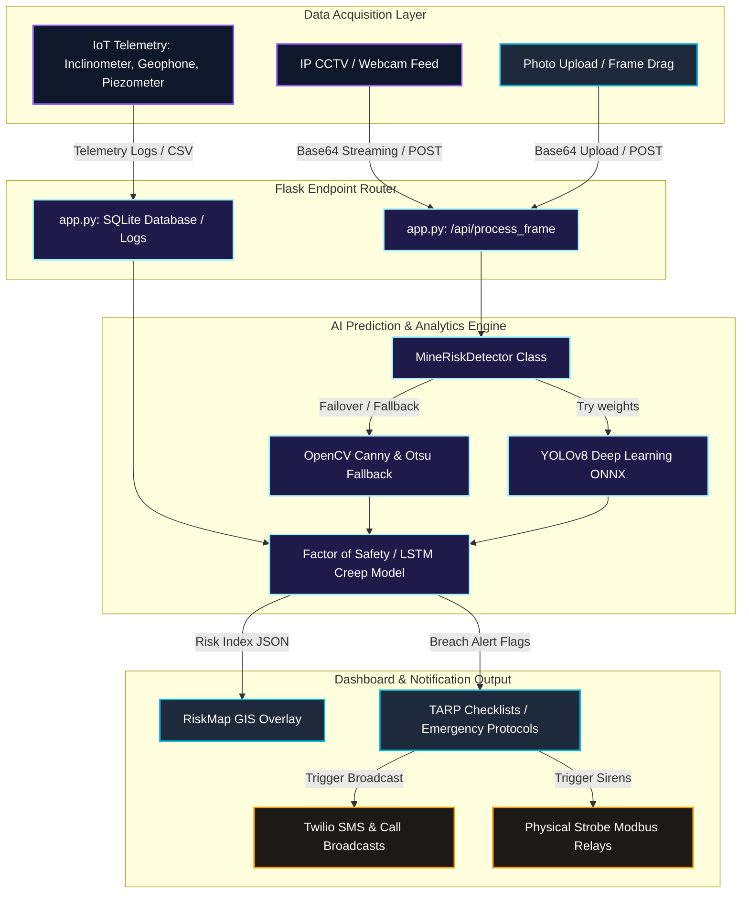
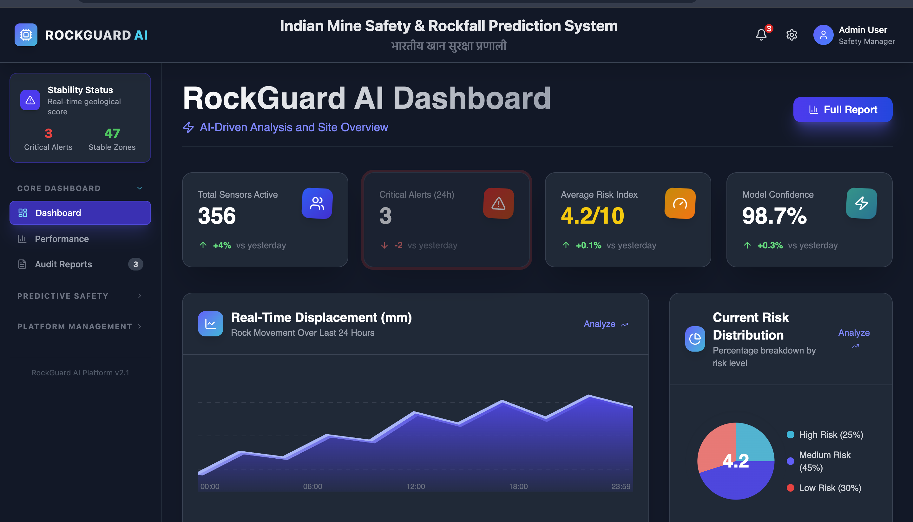
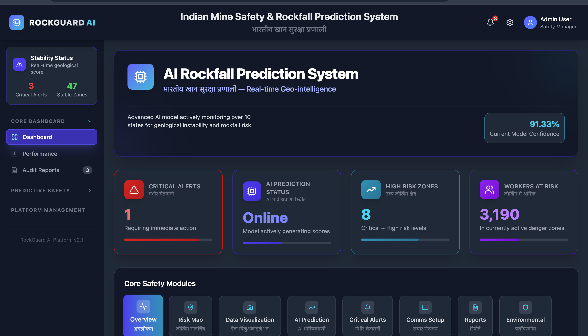

<h1 align="center">🏔️ AI-Powered Rockfall Prediction & Alert System</h1>

<p align="center">
  <strong>An Intelligent Dashboard for Open-Pit Mines to Predict, Monitor, and Alert Against Rockfall Risks.</strong>
</p>

<p align="center">
  
  
  
  
</p>

<hr>

## 📖 Overview

The **AI-Powered Rockfall Prediction & Alert System** is a full-stack solution designed for proactive safety in open-pit mines. By leveraging real-time sensor data and computer vision, this system continuously detects structural anomalies (like cracks, loose rocks, slope instability) and instantly issues alerts before accidents occur.

> [!NOTE]
> For a highly detailed technical breakdown of files, deep learning algorithms, mathematical frameworks, and IoT sensor roadmap, please refer to the comprehensive **[PROJECT_REPORT.md](file:///Volumes/CODES/newieee/SIH_PROJECT/SIH_2/PROJECT_REPORT.md)**.

### ✨ Key Features

- 🟢 **Real-Time AI Detection**: Uses OpenCV/AI backend to analyze camera feeds and evaluate geological risks.
- 📊 **Interactive Risk Dashboard**: Modern, dark-themed UI (built down to the pixel with TailwindCSS and React) displaying live data, probability gauges, and status maps.
- 🚨 **Instant Action Plans**: When a high-risk scenario is detected, the AI generates immediate, step-by-step mitigation plans.
- 🌐 **Responsive & Fast**: Lightning-fast Vite-based frontend perfectly synchronized with a lightweight Python/Flask prediction backend.
- 📱 **Multi-channel Alerts**: Structured for SMS & WhatsApp alert integration.

---

## 🔄 Interactive Project Workflow & Execution Pipeline

To understand the core mechanisms of **RockGuard AI** in one single view, we have mapped out both the computational backend data pipeline and the interactive frontend user journey. 

### 🗺️ Data Pipeline & AI Analysis Flow
This flowchart displays how sensor data, video streams, and user inputs propagate through the Python Flask backend to generate real-time AI classifications, factor of safety index predictions, and automated alarms.



### 🎯 Step-by-Step Deep Dive (Interactive Accordion)
Click on each stage of the system workflow to expand the details, look at responsible files, input/output data formats, and structural algorithms.

<details>
<summary><strong>🔐 Step 1: Secure Access & Authentication</strong></summary>
<br>

- **What Happens**: Safety managers log in to access telemetry networks, protecting sensitive hazard forecasts.
- **Responsible Components**:
  - Frontend Logic: [Login.jsx](file:///Volumes/CODES/newieee/SIH_PROJECT/SIH_2/frontend/src/components/Login.jsx) (validates user login states).
  - Context Provider: `AuthContext.jsx` (persists session token and role configurations).
- **Core Mechanism**: React state context gates all sidebars and dashboard access. If a user logs in, the session status redirects them to the geological control tower.
</details>

<details>
<summary><strong>🗺️ Step 2: GIS Mining Map & State-Wise Risk Audits</strong></summary>
<br>

- **What Happens**: The initial dashboard presents an overview of major Indian mining states (Jharkhand, Odisha, Rajasthan, etc.).
- **Responsible Components**:
  - Frontend View: [RiskMap.jsx](file:///Volumes/CODES/newieee/SIH_PROJECT/SIH_2/frontend/src/components/RiskMap.jsx) (interactive SVG grid of regions).
  - Dashboard Hub: [IndianRockfallDashboard.jsx](file:///Volumes/CODES/newieee/SIH_PROJECT/SIH_2/frontend/src/components/IndianRockfallDashboard.jsx) (coordinates risk states and aggregate totals).
- **Core Mechanism**: Hovering over interactive zones loads database counts of active crack clusters, displacement trends, and risk sizes. Users can select any state to focus geological sensors.
</details>

<details>
<summary><strong>📸 Step 3: Computer Vision Frame Capture</strong></summary>
<br>

- **What Happens**: Video feeds (CCTV/Webcams) or static geological rock uploads are converted to processed payloads.
- **Responsible Components**:
  - Image Upload View: [ImageUploadAnalysis.jsx](file:///Volumes/CODES/newieee/SIH_PROJECT/SIH_2/frontend/src/components/ImageUploadAnalysis.jsx) (handles image input selection and rendering).
  - Webcam Logic: [LiveWebcam.jsx](file:///Volumes/CODES/newieee/SIH_PROJECT/SIH_2/frontend/src/components/LiveWebcam.jsx) (slices video frames at set intervals).
- **Data Payload**: Converts image file arrays or canvas frames into base64 strings:
  ```json
  { "image": "data:image/jpeg;base64,/9j/4AAQSkZJR..." }
  ```
</details>

<details>
<summary><strong>🧠 Step 4: YOLOv8 ONNX Inference & Heuristic Fallback Pipeline</strong></summary>
<br>

- **What Happens**: The Flask backend receives the base64 payload, converts it to an OpenCV matrix, and evaluates structural cracks, loose rock bodies, and slope displacement.
- **Responsible Components**:
  - Backend Controller: [app.py](file:///Volumes/CODES/newieee/SIH_PROJECT/SIH_2/backend/app.py) (handles `/api/process_frame` endpoint).
- **Core Algorithms**:
  1. **YOLOv8 Deep Learning ONNX Model**: If the ONNX file exists, OpenCV DNN converts the frame to a $640 \times 640$ normalized blob, runs model forward passes, and resolves bounding boxes using Non-Maximum Suppression (NMS) with an IoU limit of $0.45$.
  2. **Heuristic OpenCV Fallback (Failover)**: If weights are missing, a fallback engine runs:
     - *Crack Detection*: **Canny Edge Filtering** + Contour analysis, selecting long thin shapes where aspect ratio width/height is skewed.
     - *Loose Rock Isolation*: **Gaussian Blur** + **Otsu’s Binarization** thresholding to group isolated rocks.
- **Data Response**: Returns bounding box dimensions, confidence logs, and base64-annotated overlays.
</details>

<details>
<summary><strong>📊 Step 5: Geotechnical Sensor Fusion & Saito’s Predictive Calculations</strong></summary>
<br>

- **What Happens**: Geological sensor data is combined with visual findings to predict slope safety thresholds.
- **Responsible Components**:
  - Telemetry Dashboard: [PredictionModel.jsx](file:///Volumes/CODES/newieee/SIH_PROJECT/SIH_2/frontend/src/components/PredictionModel.jsx) (dynamic graphing of telemetry metrics).
- **Predictive Mathematics**:
  - **Saito’s Inverse Velocity Linearization**: Estimates the time-of-failure (ToF) when the rate of displacement starts accelerating exponentially:
    $$\Delta t_{\text{warn}} = t_F - t_{\text{current}} = -\frac{c}{m} - t_{\text{current}}$$
    *(Failure is forecasted when the inverse velocity of movement $1/v$ approaches zero)*.
  - **Unified Factor of Safety (FoS)**: An ensemble classifier analyzes rainfall ($R_t$), pore pressure ($p_t$), vibrations ($a_t$), and movement speed ($v_t$) to calculate an index:
    - $\text{FoS} > 1.25$: Stable.
    - $1.00 < \text{FoS} \le 1.25$: Yellow Alert.
    - $\text{FoS} \le 1.00$: Immediate Collapse Risk (Red Alert).
</details>

<details>
<summary><strong>🚨 Step 6: Trigger Action Response Plans (TARP) & Alerts Dispatch</strong></summary>
<br>

- **What Happens**: Breaches in safety factors automatically generate structured safety instructions, warning safety crews.
- **Responsible Components**:
  - TARP Dashboard: [AlertSystem.jsx](file:///Volumes/CODES/newieee/SIH_PROJECT/SIH_2/frontend/src/components/AlertSystem.jsx) (handles alarm status and actions checklist).
  - Contacts Configuration: [SMSWhatsAppAlerts.jsx](file:///Volumes/CODES/newieee/SIH_PROJECT/SIH_2/frontend/src/components/SMSWhatsAppAlerts.jsx) (manages alert receiver lists).
- **Comms Dispatch**:
  - Toggles Twilio API commands for SMS or WhatsApp messages.
  - Sends Modbus TCP command packets to local strobe sirens on the mine floor.
</details>

<details>
<summary><strong>📄 Step 7: Compliance Reports & Safety Audits</strong></summary>
<br>

- **What Happens**: Safety managers generate reports documenting incident timestamps, sensor status, and mitigation steps.
- **Responsible Components**:
  - Reports Panel: [ReportGenerator.jsx](file:///Volumes/CODES/newieee/SIH_PROJECT/SIH_2/frontend/src/components/ReportGenerator.jsx) (manages compliance templates and PDF printing).
- **Outcome**: A certified audit report to export for regulatory bodies (DGMS / MSHA), confirming active monitoring protocols.
</details>

---

## 🛠️ Technology Stack

| Domain | Technology / Tool Engine |
| :--- | :--- |
| **Frontend** | React 19, Vite, TailwindCSS (v4), Recharts, Lucide React Icons |
| **Backend** | Python 3.9+, Flask, OpenCV, Python-dotenv, Flask-CORS |
| **Package Managers** | npm / pnpm, pip |

---

## 🚀 Quick Start Guide

Ready to run the project locally? Follow these simple steps.

### 1. Clone the Repository
```bash
git clone https://github.com/AbhiMahto/AI-Powered-Rockfall-Prediction-and-Alert-System-for-Open-Pit-Mines-.git
cd AI-Powered-Rockfall-Prediction-and-Alert-System-for-Open-Pit-Mines-
```

### 2. Start the Backend (AI Prediction Server)
Open a new terminal and navigate to the backend directory:
```bash
cd backend
python3 -m venv venv
source venv/bin/activate  # On Windows use: venv\Scripts\activate
pip install -r requirements.txt
python app.py
```
*The backend server will start at `http://127.0.0.1:5000`*

### 3. Start the Frontend (User Dashboard)
Open a second terminal and navigate to the frontend directory:
```bash
cd frontend
npm install
npm run dev
```
*The frontend will be available at `http://localhost:5173`*

---

## 📂 Project Structure

```text
├── backend/                      # Python Flask Backend
│   ├── app.py                    # Main Flask application & Server Endpoints
│   ├── start_backend.py          # Start script
│   ├── requirements.txt          # Python dependencies
│   └── README.md                 # Detailed backend documentation
│
├── frontend/                     # React + Vite Frontend
│   ├── src/
│   │   ├── components/           # Reusable UI & Dashboard Components
│   │   ├── charts/               # Recharts Data Visualizations
│   │   ├── contexts/             # React State Contexts 
│   │   ├── data/                 # Mock Risk Data / Configurations
│   │   ├── App.jsx               # Main Application Routing
│   │   └── main.jsx              # React DOM Entry
│   ├── index.html                # HTML Base
│   ├── package.json              # NPM Configuration
│   └── vite.config.js            # Vite configuration
│
└── .gitignore                    # Root level Git ignores (node_modules, venvs, etc.)
```

---

## 📸 Screenshots & UI Previews




---

## 🤝 Contributing

Contributions, issues, and feature requests are welcome!
Feel free to check [issues page](https://github.com/AbhiMahto/AI-Powered-Rockfall-Prediction-and-Alert-System-for-Open-Pit-Mines-/issues).

## 📜 License

This project is licensed under the MIT License - see the LICENSE file for details.

---
<p align="center">
  <i>Built with safety and precision in mind.</i>
</p>
